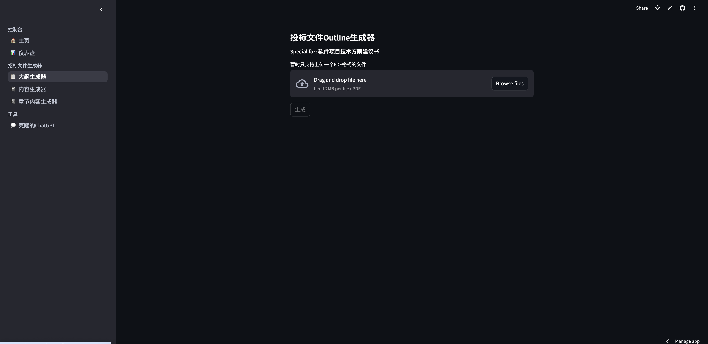

# 投标文件生成器的beta版本

## Step 1 生成Outline

### 使用说明

- 上传一份招标文件（ [招标文件示例](files/instruction/tender01.pdf) ），暂时只支持PDF格式且一个文件，大小小于2兆。
- 上传完成，点击生成按键，会根据上传文件内容判断是否为招标文件，如果是则判断是否为软件行业项目，如果是会生成一份Outline。

## Step 2 生成内容

### 使用说明

- 上传一份招标文件（ [招标文件示例](files/instruction/tender01.pdf) ），暂时只支持PDF格式且一个文件，大小小于2兆。
- 把生成的或者自己撰写的Outline输入到一个text-area里面。
- 上传完成，点击生成按键，会根据上传文件内容和Outline生成一份内容，生成后出现下载按键，点击可以下载（每一个章节的字数限制是600）。

## Q&A

**Q:** 为什么会限制文件大小？

**A:** LLM的model使用的是OpenAI的GPT-4o，他的Context window数量是128,000 tokens，在进行文本生成的时候是把全部文本作为参数的，所以大文件会导致token溢出。

**Q:** 为什么不使用RAG来解决文件大小问题呢？

**A:** RAG一般使用矢量数据库，会有针对性的回答用户提出的问题，但是对问题的限制是有的，而恰恰此项目中需要解决的问题RAG无法直接给出答案

比如：

问题1：给我总结一下文件里面说的是什么？

问题2：给我生成一份outline？

以上两个问题，通过RAG，LLM的回答一般都会是“我不知道”

**Q:** 该如何改进RAG？

**A**: 使用问题链Chain of Question，通过一个个简单问题得出生成Outline所需的内容。**引出的问题就是如何生成有针对性的有逻辑联系的问题列表？**

**Q:** 为什么不用LangChain中的load_summarize_chain来处理大文件，获取其摘要，然后使用摘要在生成outline呢？

**A:** load_summarize_chain是 LangChain 框架中用于文本摘要的一个方法，其中chain_type参数(stuff、map_reduce和refine)决定了摘要链的工作方式。

- stuff 会将所有输入文档的内容直接加载到内存中，然后一次性传递给语言模型，让模型生成摘要。
- map_reduce 将文档分成多个小块，先对每个小块生成局部摘要（map 阶段），然后对这些局部摘要再次生成全局摘要（reduce 阶段）。
- refine 使用增量式的方法生成摘要。它会先为第一块文档生成初步摘要，然后依次加入后续文档，根据新的内容逐步修改或改进摘要。

使用stuff依然会有token溢出的问题；而使用map_reduce或者refine会消耗大量的时间资源和计算资源（多次调用模型）。

**Q:** 为什么限制600字？

**A:** 对于Outline的每个章节来说，字数的权重是不一样的。如果把字数提高如2000的话，会出现一个问题就是，LLM会把本应属于其他章节的内容写到当下的章节中，会出现比较严重的overlap。

**Q:** 该如何解决600字的限制呢？

**A:** 现阶段提供的一个章节内容生产器。

- 上传一份招标文件（ [招标文件示例](files/instruction/tender01.pdf) ），暂时只支持PDF格式且一个文件，大小小于2兆。

- 输入一个章节最小的字数。

  如：1000

- 输入项目名称。

  如：中国移动通信集团黑龙江有限公司-电子邮件系统-技术方案建议书。

- 输入章节标题，标题需要包含其父标题。

  如：7.邮件系统方案设计-总体架构设计-两层部署逻辑架构；8.邮件系统方案设计-总体架构设计-Messaging Server各模块逻辑架构；9.邮件系统方案设计-总体架构设计-物理部署结构-邮件网关。

- 点击生成，会生成一份只包含特定章节的内容。

**Q:** 为什么只有图片描述，而没有实际的图片。

**A:** 计划图片是由AI自动生成的，我使用的是Openai的dall-e-3，但是生成的效果我个人判断是无法再标书中使用的。

如：邮件服务器集群部署图：该图展示了多台邮件服务器通过负载均衡器连接的结构。每台服务器都配置有冗余硬件，确保高可用性。负载均衡器负责将用户请求分配到不同的服务器上，以实现负载均衡。

生成的图为：

## 计费统计

LLM的model使用的是GPT-4o，一般一次生成内容需要调用8到12次（根据章节个数不同），每次会调用web search大约为6到8次（根据章节个数不同）。

生产10000字的内容每次需要大约0.3到0.6美金。

## 后续阶段

- 建立RAG的问题链Chain of Question，用以完成Outline的生成。
- 问题链需要领域知识，严重AI是否能独立完成。
- 精细化Outline，根据实际需求生成深层的Outline。
- 获取一个image search engine AI，用以完成文章中图片。
- 完成review节点，对生成的文章进行review。
- 建立知识库，用于RAG的问答。
- 如果问题链问题解决，使用问题链生成实际文章内容，用以减少现阶段生成内容和后续review的资源消耗。

## Appendix

### GPT-4o收费标准

（https://openai.com/api/pricing/）

### TavilyAI收费标准

（https://tavily.com/#pricing）

